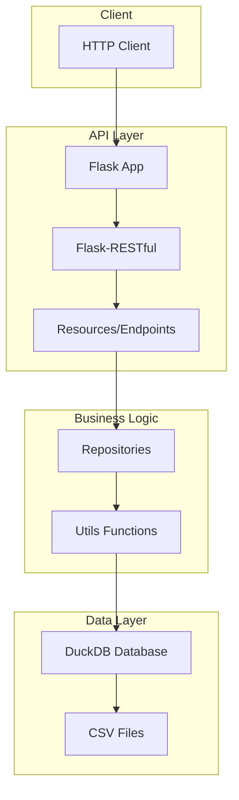
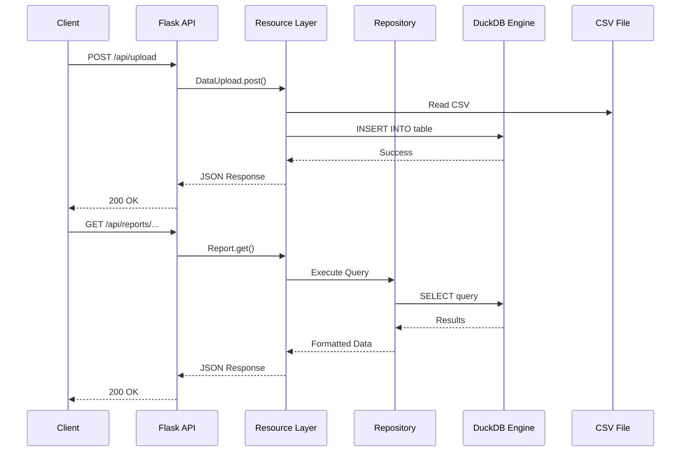

# Globant Challenge - DuckDB API

This repository contains a REST API developed in Python with Flask that uses DuckDB as a database for processing and analyzing employee hiring data.

## 🏗️ System Architecture

### General Architecture Diagram



### API-DuckDB Interaction Diagram



## 📁 Project Structure

```
globant-challenge-duckdb-api/
├── api/                          # Main application module
│   ├── app.py                    # Main Flask file
│   ├── requirements.txt          # Python dependencies
│   ├── Dockerfile               # Docker configuration
│   ├── resources/               # API endpoints
│   │   ├── data_upload.py       # Endpoint for uploading CSV files
│   │   ├── hires_by_quarter.py  # Quarterly hiring report
│   │   └── department_hires.py  # Department hiring report
│   ├── repositories/            # Data access layer
│   │   └── reports.py          # Class for report queries
│   └── utils/                   # Utility functions
│       ├── duckdb_runner.py     # Class for executing DDL and queries
│       └── utils_functions.py   # Auxiliary functions
├── data/                        # Data and schemas
│   ├── csv/                     # Example CSV files
│   └── duckdb/                  # DuckDB configuration
│       ├── db/                  # DuckDB database
│       ├── ddl/                 # Table creation scripts
│   │   ├── departments.sql
│   │   ├── jobs.sql
│   │   └── hired_employees.sql
│   │   └── dml/                 # Data manipulation scripts
├── docs/                        # Additional documentation
└── README.md                    # This file
```

## 🚀 Technologies Used

- **Python 3.x**: Main programming language
- **Flask**: Web framework for REST API
- **Flask-RESTful**: Extension for creating RESTful APIs
- **DuckDB**: Embedded analytical database
- **Pandas**: Data manipulation and analysis
- **Docker**: Application containerization
- **GCP Cloud Run**: Deployment platform

## 📋 Prerequisites

### For Local Deployment
- Python 3.8 or higher
- pip (Python package manager)
- Git

### For GCP Deployment
- Google Cloud Platform account
- Google Cloud CLI installed
- Docker installed
- Administrator permissions in GCP project

## 🛠️ Local Deployment with Docker

### 1. Clone the Repository
```bash
git clone <repository-url>
cd globant-challenge-duckdb-api
```

### 2. Build Docker Image
```bash
docker build -t duckdb-api -f api/Dockerfile .
```

### 3. Run Docker Container with Local Database
```bash
docker run -p 8081:8081 \
  -v $(pwd)/data/duckdb/db:/app/data/duckdb/db \
  -v $(pwd)/data/csv:/app/data/csv \
  --name duckdb-api-container \
  duckdb-api
```

The API will be available at: `http://localhost:8081`

### 4. Test the Endpoints

**Upload CSV file:**
```bash
curl -X POST \
  http://localhost:8081/api/upload \
  -F "file=@/path/to/your/file.csv" \
  -F "table_name=table_name"
```

**Get quarterly hiring report:**
```bash
curl http://localhost:8081/api/reports/hires_by_quarter/2021
```

**Get department hiring report:**
```bash
curl http://localhost:8081/api/reports/department_hires/2021
```

### 5. Manage Docker Container

**Stop the container:**
```bash
docker stop duckdb-api-container
```

**Start the container again (data persists):**
```bash
docker start duckdb-api-container
```

**Remove container:**
```bash
docker rm duckdb-api-container
```

**Remove container and image:**
```bash
docker rm duckdb-api-container
docker rmi duckdb-api
```

## ☁️ GCP Cloud Run Deployment

### 1. Configure Google Cloud CLI
```bash
gcloud auth login
gcloud config set project <your-project-id>
```

### 2. Enable Required APIs
```bash
gcloud services enable cloudbuild.googleapis.com
gcloud services enable run.googleapis.com
```

### 3. Build and Upload Image
```bash
cd api
gcloud builds submit --tag gcr.io/<your-project-id>/duckdb-api
```

### 4. Deploy to Cloud Run
```bash
gcloud run deploy duckdb-api \
  --image gcr.io/<your-project-id>/duckdb-api \
  --platform managed \
  --region us-central1 \
  --allow-unauthenticated \
  --port 8081
```

### 5. Configure Environment Variables (Optional)
```bash
gcloud run services update duckdb-api \
  --update-env-vars DUCKDB_PATH="/tmp/data.db"
```

### 6. Get Service URL
```bash
gcloud run services describe duckdb-api --region us-central1 --format="value(status.url)"
```

### 7. Test the Deployment
```bash
# Replace <URL> with the URL obtained in the previous step
curl -X POST \
  <URL>/api/upload \
  -F "file=@/path/to/your/file.csv" \
  -F "table_name=employees"
```

## 📊 API Endpoints

### POST /api/upload
Uploads a CSV file and inserts it into the DuckDB database.

**Parameters:**
- `file`: CSV file (multipart/form-data)
- `table_name`: Name of the table where to insert the data

**Example response:**
```json
{
  "message": "Records inserted in employees",
  "filas_removidas": 5
}
```

### GET /api/reports/hires_by_quarter/{year}
Gets a quarterly hiring report for a specific year.

**Parameters:**
- `year`: Year for the report (e.g., 2021)

**Example response:**
```json
[
  {
    "department": "Engineering",
    "job": "Software Engineer",
    "Q1": 10,
    "Q2": 15,
    "Q3": 8,
    "Q4": 12
  }
]
```

### GET /api/reports/department_hires/{year}
Gets a report of departments that hired more employees than the average for a specific year.

**Parameters:**
- `year`: Year for the report (e.g., 2021)

**Example response:**
```json
[
  {
    "id": 1,
    "department": "Engineering",
    "hired": 45
  }
]
```

## 🔧 Configuration

### Environment Variables
- `PORT`: Port where the application will run (default: 8081)
- `DUCKDB_PATH`: Path to the DuckDB database file (default: ../data/duckdb/db/data.db)

### Data Structure
The application expects CSV files with the following structures:

**departments.csv:**
```csv
id,department
1,Engineering
2,Sales
```

**jobs.csv:**
```csv
id,job
1,Software Engineer
2,Sales Representative
```

**hired_employees.csv:**
```csv
id,name,hire_datetime,department_id,job_id
1,John Doe,2021-01-15T10:30:00Z,1,1
```

## 🐛 Troubleshooting

### DuckDB Connection Error
If you get a file lock error:
```bash
# Check processes using the database
lsof | grep data.db
# Kill the process if necessary
kill <PID>
```

### GCP Permissions Error
Make sure you have the following roles:
- Cloud Run Admin
- Cloud Build Editor
- Storage Admin

## 📝 Additional Notes

- The application automatically creates tables in DuckDB on startup
- CSV files are processed in batches of 1000 rows to optimize performance
- Rows with NaN values are automatically removed and saved to a separate file
- The DuckDB database is stored locally in the Cloud Run container (resets with each deploy)

## 🤝 Contributing

1. Fork the project
2. Create a feature branch (`git checkout -b feature/AmazingFeature`)
3. Commit your changes (`git commit -m 'Add some AmazingFeature'`)
4. Push to the branch (`git push origin feature/AmazingFeature`)
5. Open a Pull Request 